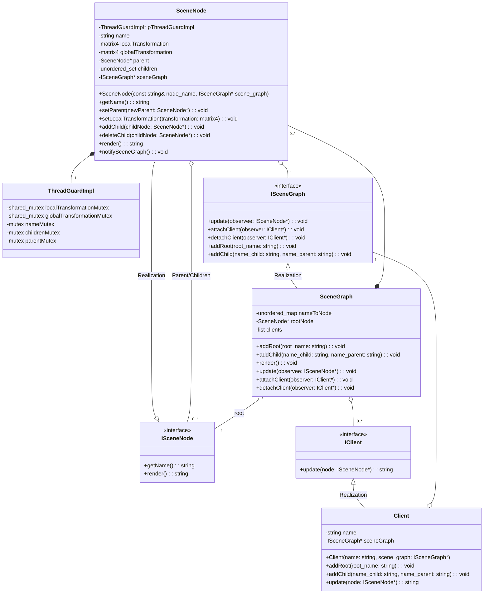

```mermaid
classDiagram
    class ISceneNode {
        <<interface>> 
        +getName(): string
        +render(): string
    }
    class SceneNode {
        -ThreadGuardImpl* pThreadGuardImpl
        -string name
        -matrix4 localTransformation
        -matrix4 globalTransformation
        -SceneNode* parent
        -unordered_set<SceneNode*> children
        -ISceneGraph* sceneGraph
        +SceneNode(const string& node_name, ISceneGraph* scene_graph)
        +getName(): string
        +setParent(newParent: SceneNode*): void
        +setLocalTransformation(transformation: matrix4): void
        +addChild(childNode: SceneNode*): void
        +deleteChild(childNode: SceneNode*): void
        +render(): string
        +notifySceneGraph(): void
    }
    class ThreadGuardImpl {
        -shared_mutex localTransformationMutex
        -shared_mutex globalTransformationMutex
        -mutex nameMutex
        -mutex childrenMutex
        -mutex parentMutex
    }
    class ISceneGraph {
        <<interface>> 
        +update(observee: ISceneNode*): void
        +attachClient(observer: IClient*): void
        +detachClient(observer: IClient*): void
        +addRoot(root_name: string): void
        +addChild(name_child: string, name_parent: string): void
    }
    class SceneGraph {
        -unordered_map<string, SceneNode> nameToNode
        -SceneNode* rootNode
        -list<IClient*> clients
        +addRoot(root_name: string): void
        +addChild(name_child: string, name_parent: string): void
        +render(): void
        +update(observee: ISceneNode*): void
        +attachClient(observer: IClient*): void
        +detachClient(observer: IClient*): void
    }
    class IClient {
        <<interface>> 
        +update(node: ISceneNode*): string
    }
    class Client {
        -string name
        -ISceneGraph* sceneGraph
        +Client(name: string, scene_graph: ISceneGraph*)
        +addRoot(root_name: string): void
        +addChild(name_child: string, name_parent: string): void
        +update(node: ISceneNode*): string
    }
    
    SceneNode --|> ISceneNode: Realization
    SceneNode *-- "1" ThreadGuardImpl
    SceneNode o-- "0..*" ISceneNode: Parent/Children
    SceneNode o-- "1" ISceneGraph
    ISceneGraph <|-- SceneGraph: Realization
    SceneGraph *-- "0..*" SceneNode
    SceneGraph o-- "1" ISceneNode: root
    SceneGraph o-- "0..*" IClient
    IClient <|-- Client: Realization
    Client o-- "1" ISceneGraph

```