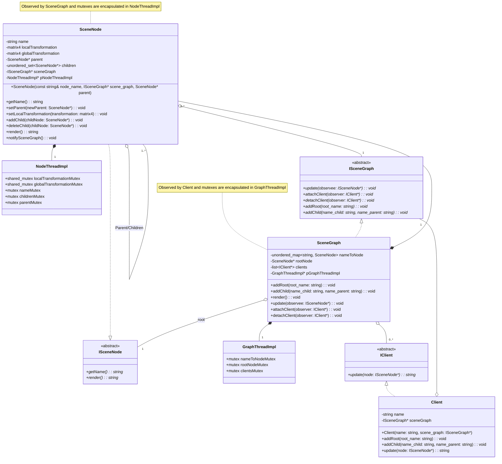

```mermaid
classDiagram
    note for SceneNode "Observed by SceneGraph and mutexes are encapsulated in NodeThreadImpl"
    note for SceneGraph "Observed by Client and mutexes are encapsulated in GraphThreadImpl"
    class ISceneNode {
        <<abstract>> 
        +getName()*: string
        +render()*: string
    }
    class SceneNode {
        -string name
        -matrix4 localTransformation
        -matrix4 globalTransformation
        -SceneNode* parent
        -unordered_set~SceneNode*~ children
        -ISceneGraph* sceneGraph
        -NodeThreadImpl* pNodeThreadImpl
        +SceneNode(const string& node_name, ISceneGraph* scene_graph, SceneNode* parent)
        +getName(): string
        +setParent(newParent: SceneNode*): void
        +setLocalTransformation(transformation: matrix4): void
        +addChild(childNode: SceneNode*): void
        +deleteChild(childNode: SceneNode*): void
        +render(): string
        +notifySceneGraph(): void
    }
    class NodeThreadImpl {
        +shared_mutex localTransformationMutex
        +shared_mutex globalTransformationMutex
        +mutex nameMutex
        +mutex childrenMutex
        +mutex parentMutex
    }
    class ISceneGraph {
        <<abstract>> 
        +update(observee: ISceneNode*)*: void
        +attachClient(observer: IClient*)*: void
        +detachClient(observer: IClient*)*: void
        +addRoot(root_name: string)*: void
        +addChild(name_child: string, name_parent: string)*: void
    }
    class SceneGraph {
        -unordered_map~string, SceneNode~ nameToNode
        -SceneNode* rootNode
        -list~IClient*~ clients
        -GraphThreadImpl* pGraphThreadImpl
        +addRoot(root_name: string): void
        +addChild(name_child: string, name_parent: string): void
        +render(): void
        +update(observee: ISceneNode*): void
        +attachClient(observer: IClient*): void
        +detachClient(observer: IClient*): void
    }
    class GraphThreadImpl {
        +mutex nameToNodeMutex
        +mutex rootNodeMutex
        +mutex clientsMutex
    }
    class IClient {
        <<abstract>> 
        +update(node: ISceneNode*)*: string
    }
    class Client {
        -string name
        -ISceneGraph* sceneGraph
        +Client(name: string, scene_graph: ISceneGraph*)
        +addRoot(root_name: string): void
        +addChild(name_child: string, name_parent: string): void
        +update(node: ISceneNode*): string
    }
    
    SceneNode ..|> ISceneNode
    SceneNode *-- "1" NodeThreadImpl
    SceneNode o-- "1..*" SceneNode: Parent/Children
    SceneNode o-- "1" ISceneGraph
    ISceneGraph <|.. SceneGraph
    SceneGraph *-- "1" GraphThreadImpl
    SceneGraph *-- "0..*" SceneNode
    SceneGraph o-- "1" ISceneNode: root
    SceneGraph o-- "0..*" IClient
    IClient <|.. Client
    Client o-- "1" ISceneGraph

```